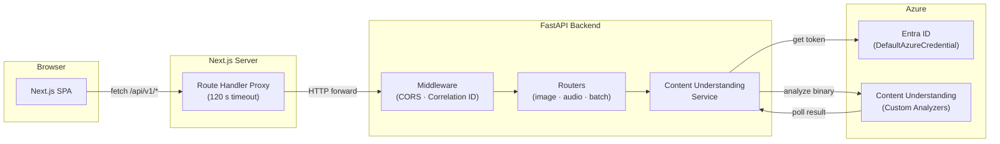
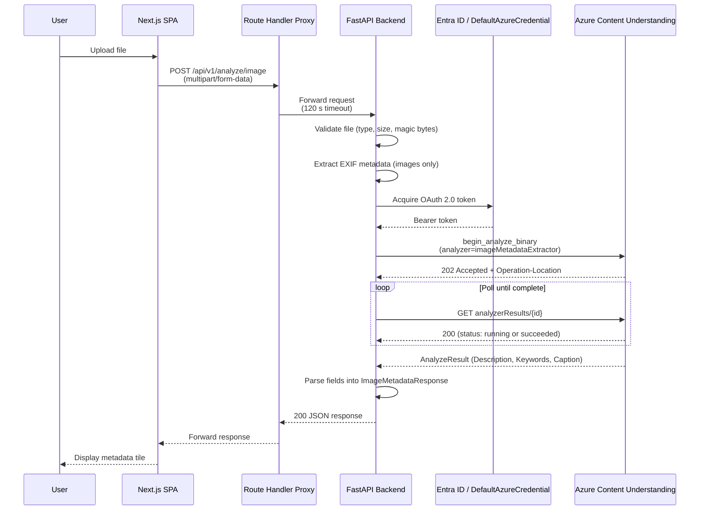
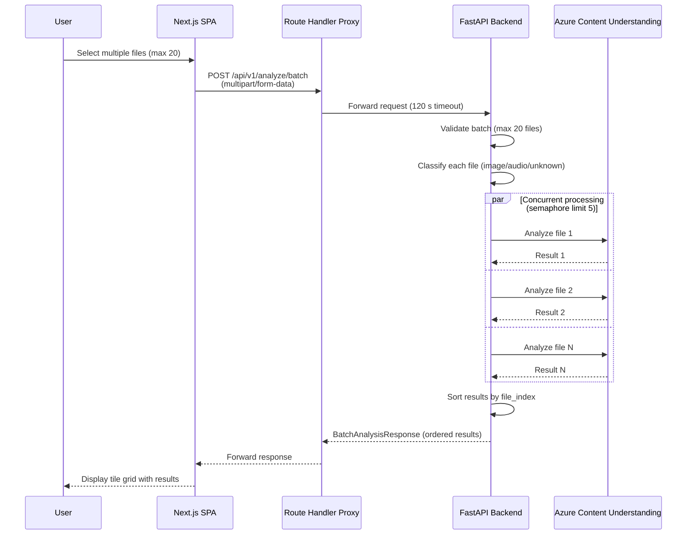
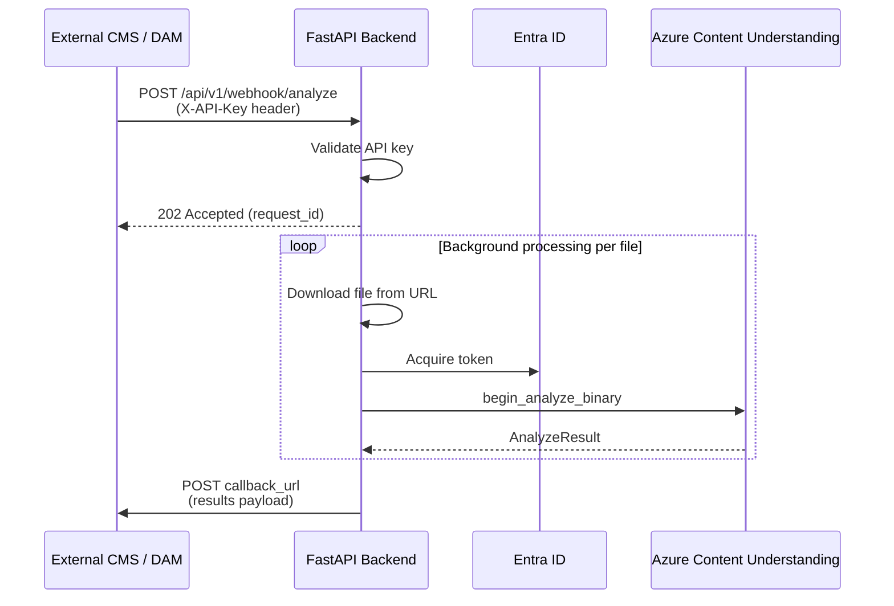

# Data Flow

## Architecture Data Flow

```mermaid
graph LR
    subgraph Browser
        UI[Next.js SPA]
    end

    subgraph Next.js Server
        RP["Route Handler Proxy<br/>(120 s timeout)"]
    end

    subgraph FastAPI Backend
        MW["Middleware<br/>(CORS · Correlation ID)"]
        RT["Routers<br/>(image · audio · batch)"]
        SVC["Content Understanding<br/>Service"]
    end

    subgraph Azure
        AUTH["Entra ID<br/>(DefaultAzureCredential)"]
        CU["Content Understanding<br/>(Custom Analyzers)"]
    end

    UI -->|"fetch /api/v1/*"| RP
    RP -->|"HTTP forward"| MW
    MW --> RT --> SVC
    SVC -->|"get token"| AUTH
    SVC -->|"analyze binary"| CU
    CU -->|"poll result"| SVC
```

## Single File Analysis

```mermaid
sequenceDiagram
    participant User
    participant Browser as Next.js SPA
    participant Proxy as Route Handler Proxy
    participant API as FastAPI Backend
    participant Auth as Entra ID / DefaultAzureCredential
    participant CU as Azure Content Understanding

    User->>Browser: Upload file
    Browser->>Proxy: POST /api/v1/analyze/image<br/>(multipart/form-data)
    Proxy->>API: Forward request<br/>(120 s timeout)
    API->>API: Validate file (type, size, magic bytes)
    API->>API: Extract EXIF metadata (images only)

    API->>Auth: Acquire OAuth 2.0 token
    Auth-->>API: Bearer token

    API->>CU: begin_analyze_binary<br/>(analyzer=imageMetadataExtractor)
    CU-->>API: 202 Accepted + Operation-Location

    loop Poll until complete
        API->>CU: GET analyzerResults/{id}
        CU-->>API: 200 (status: running or succeeded)
    end

    CU-->>API: AnalyzeResult (Description, Keywords, Caption)
    API->>API: Parse fields into ImageMetadataResponse
    API-->>Proxy: 200 JSON response
    Proxy-->>Browser: Forward response
    Browser-->>User: Display metadata tile
```

## Batch Upload Flow

```mermaid
sequenceDiagram
    participant User
    participant Browser as Next.js SPA
    participant Proxy as Route Handler Proxy
    participant API as FastAPI Backend
    participant CU as Azure Content Understanding

    User->>Browser: Select multiple files (max 20)
    Browser->>Proxy: POST /api/v1/analyze/batch<br/>(multipart/form-data)
    Proxy->>API: Forward request (120 s timeout)
    API->>API: Validate batch (max 20 files)
    API->>API: Classify each file (image/audio/unknown)

    par Concurrent processing (semaphore limit 5)
        API->>CU: Analyze file 1
        CU-->>API: Result 1
    and
        API->>CU: Analyze file 2
        CU-->>API: Result 2
    and
        API->>CU: Analyze file N
        CU-->>API: Result N
    end

    API->>API: Sort results by file_index
    API-->>Proxy: BatchAnalysisResponse (ordered results)
    Proxy-->>Browser: Forward response
    Browser-->>User: Display tile grid with results
```

## Webhook Integration Flow

```mermaid
sequenceDiagram
    participant CMS as External CMS / DAM
    participant API as FastAPI Backend
    participant Auth as Entra ID
    participant CU as Azure Content Understanding

    CMS->>API: POST /api/v1/webhook/analyze<br/>(X-API-Key header)
    API->>API: Validate API key
    API-->>CMS: 202 Accepted (request_id)

    loop Background processing per file
        API->>API: Download file from URL
        API->>Auth: Acquire token
        API->>CU: begin_analyze_binary
        CU-->>API: AnalyzeResult
    end

    API->>CMS: POST callback_url<br/>(results payload)
```

## Proxy Architecture

The Next.js Route Handler proxy (`src/app/api/v1/[...path]/route.ts`) is a critical part of the data flow:

1. Catches all `/api/v1/*` requests from the browser
2. Buffers the request body (for reliable multipart forwarding)
3. Forwards to `http://localhost:8000` (configurable via `BACKEND_URL` env var)
4. Applies a **120-second timeout** to support long-running Azure analysis
5. Strips hop-by-hop headers (`host`, `connection`, `expect`, etc.)
6. Returns structured error responses on timeout (504) or connection failure (502)

## Data Models

### Image Metadata

| Field | Type | Description |
|-------|------|-------------|
| `description` | `string` | Detailed natural-language description (German) |
| `keywords` | `string[]` | Relevant tags for search and categorization |
| `caption` | `string` | Concise, publication-ready image subtitle |

### Audio Metadata

| Field | Type | Description |
|-------|------|-------------|
| `description` | `string` | Detailed summary of audio content (German) |
| `keywords` | `string[]` | Relevant tags for search and categorization |
| `summary` | `string` | One-sentence summary |
