# Data Flow

## Single File Analysis

## Batch Upload Flow

```mermaid
sequenceDiagram
    participant User
    participant Frontend as Next.js Frontend
    participant API as FastAPI Backend
    participant CU as Azure Content Understanding

    User->>Frontend: Upload multiple files (≤ 20)
    Frontend->>API: POST /api/v1/analyze/batch (multipart)
    loop For each file (concurrent)
        API->>CU: Analyze file
        CU-->>API: Result
    end
    API-->>Frontend: BatchAnalysisResponse (ordered results)
    Frontend-->>User: Display tile grid
```

## Webhook Integration Flow

## Data Models

### Image Metadata

| Field | Type | Description |
|-------|------|-------------|
| `description` | `string` | Detailed natural-language description (German) |
| `keywords` | `string[]` | Relevant tags for search and categorization |
| `caption` | `string` | Concise, publication-ready image subtitle |

### Audio Metadata

| Field | Type | Description |
|-------|------|-------------|
| `description` | `string` | Detailed summary of audio content (German) |
| `keywords` | `string[]` | Relevant tags for search and categorization |
| `summary` | `string` | One-sentence summary |
