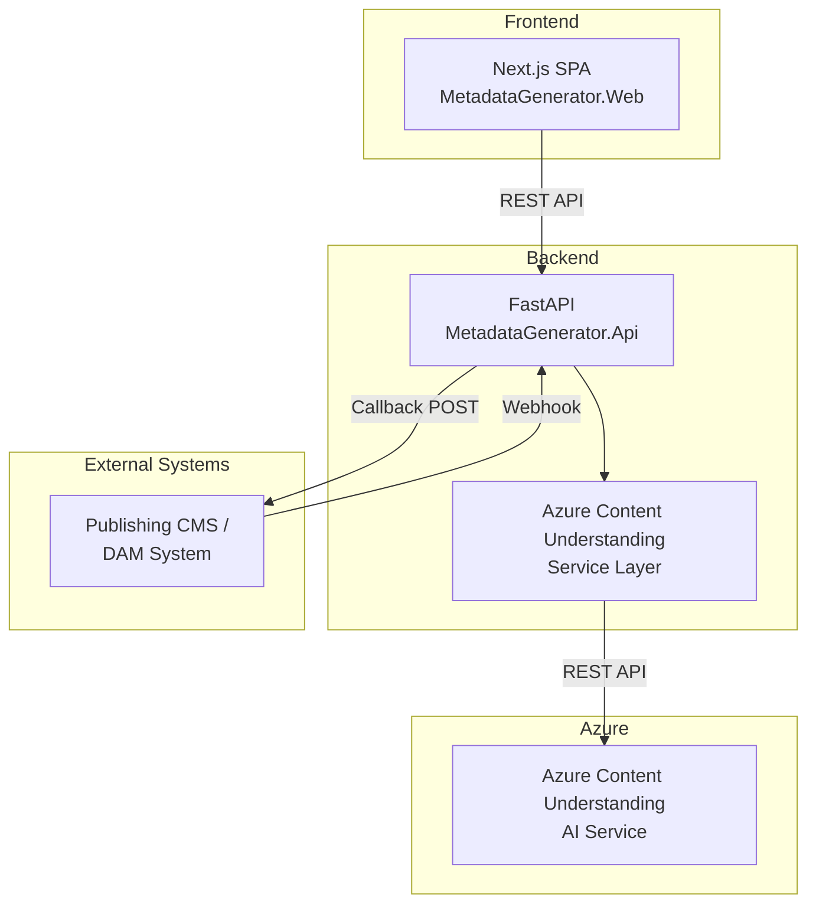

# Architecture Overview

High-level architecture of the Metadata Generator system.

## System Diagram

## Key Components

| Component | Technology | Purpose |
|-----------|-----------|---------|
| **MetadataGenerator.Api** | Python 3.12, FastAPI | Backend API — file processing, AI integration, webhook |
| **MetadataGenerator.Web** | Next.js 16, React 19, TypeScript | Frontend SPA — upload UI, metadata display, export |
| **Azure Content Understanding** | Azure AI | Image and audio analysis — generates descriptions, keywords, captions |

## Design Principles

- **Separation of concerns**: Frontend handles presentation, backend handles business logic and AI integration.
- **Type-safe contracts**: Pydantic models (backend) and TypeScript interfaces (frontend) enforce API contracts.
- **Modular services**: Azure integration is wrapped in an injectable service layer for testability.
- **German output**: All AI-generated metadata is configured for German language output.
